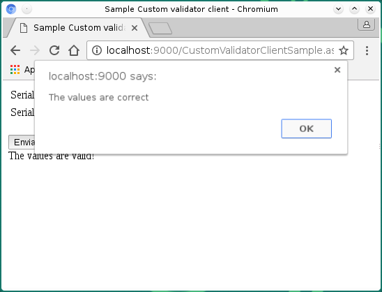

# Usando el control CustomValidator de ASP.NET

      Hay ocasiones en que tenemos que comparar las entradas de los formularios con ciertos patrones que son demasiado complejos que requieren ciertas operaciones adicionales a las proporcionadas por los controles de validación predeterminados, existe también la posibilidad de usar métodos de validación previamente creadas con  algún lenguaje de programación Script del lado del cliente, para estos casos .NET proporciona el control <b>CustomValidator</b> el cual nos permite usar funciones personalizadas tanto del lado del cliente como del lado del servidor.
    

    

      Este control puede emplearse tanto del lado del servidor <b>(Server-side)</b> como del lado del cliente <b>(Client-side)</b>.
Para mostrar su utilización escribí dos ejemplos el primero compara las entradas del lado del servidor y el segundo hace las mismas comparaciones del lado del cliente.
    

    <h3>Validando del lado del servidor (Server side)</h3>
    
El primer ejemplo muestra la utilización de este control del lado del servidor (server-side).

    
<b>Fig 1. El programa con el control CustomValidator en ejecucción.</b>
 
    

 
    
<b>Fig 2. El programa ejecutando las validaciones correspondientes.</b>
 
    

 
    
<b>Fig 3. Las validaciones requeridas fueron correctas.</b>
 
    

 
    <h3>Validando del lado del cliente (Client side)</h3>
    

      El segundo ejemplo muestra las validaciones del lado del cliente (client-side), para este ejemplo es importante escribir antes que nada las funciones en JavaScript que servirán para hacer la validación, y que se utilizan en la propiedad <b>ClientValidationFunction</b>. 
    

     
    
<b>Fig 4. El programa ejecutando una de las validaciones.</b>
 
    

 
    
<b>Fig 5. El programa ejecutando ambas validaciones.</b>
 
    

 
    
<b>Fig 6. El programa muestra un popup indicando que las validaciones son correctas.</b>
 
    

 
    
<b>Fig 7. El programa muestra un mensaje indicando que las validaciones son correctas.</b>
 
    

 
    
La siguiente tabla muestra algunas propiedades del control.

    <table border="1">
      <tr>
        <td><b>Display</b></td>
        <td>
          

            Esta propiedad tiene 3 valores
            <ol>
              <li><b>Static:</b> es la propiedad predeterminada, reserva un espacio suficiente en la página para mostrar el mensaje de error.</li>
<li><b>Dynamic:</b> el espacio para mostrar el mensaje no se reserva, cuando el mensaje se despliega se desplaza el contenido existente en la página.</li>
<li><b>None:</b> el mensaje no será desplegado en el lugar del control sino en el control ValidationSummary si se localiza en la misma página.</li>
            </ol>
          

        </td>
      </tr>
      <tr>
        <td><b>Errormessage</b></td>
        <td>
          

            El texto del mensaje de error del control.
          

        </td>
      </tr>
      <tr>
        <td><b>ControlToValidate</b></td>
        <td>
          

            El control de donde obtendremos el valor para validar.
          

        </td>
      </tr>
      <tr>
        <td><b>ClientValidationFunction</b></td>
        <td>
          

            La función script del lado del cliente con la cual haremos la operación sobre el valor del control a validar.
          

        </td>
      </tr>
      <tr>
        <td><b>OnServerValidate</b></td>
        <td>
          

            El método del lado del servidor que tiene la operación que realizaremos con el valor del control
          

        </td>
      </tr>
    </table>